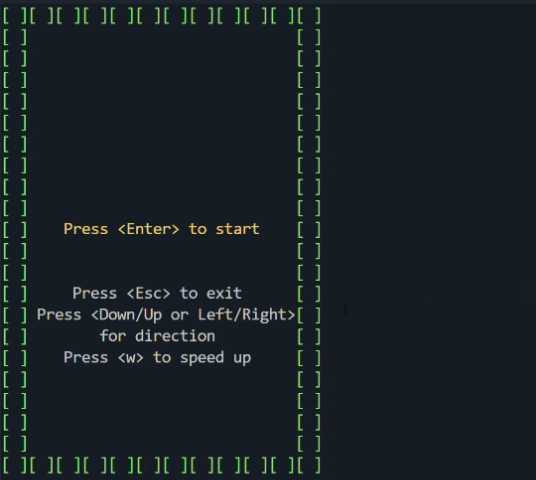
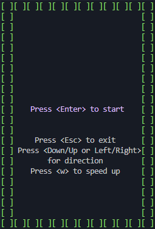

# Brick Game: Snake
## Project Description
**Brick Game: Snake** is a continuation of the classic [**Brick Game: Tetris**](https://github.com/Famur05/tetris-c) project, expanding it with a new game — **Snake**, implemented in **C++** using **object-oriented programming** and the **MVC design pattern**, also uses **finite state machines** for game logic. This project integrates both **console** and **desktop**(written on the Qt framework) interfaces, supporting both **Tetris** (written in C) and **Snake** (written in C++).

- 
- 
- 
---
- 
- 
- 

## Technologies Used

- Language: C++17
- GUI: Qt
- Testing: Google Test
- Build System: Makefile and CMake
- Code Style: Google C++ Style

## Game Features

- Field size: 10×20 cells
- Starting snake length: 4 cells
- Win condition: snake length reaches 200
- Lose condition: collision with wall or self
- Controls: directional input (left/right relative to current direction)
- Random apple placement
- Speed boost key support   
- 

## Additional Features

- Score tracking (1 point per apple)
- Persistent high score (stored in .txt file)
- Leveling system: level increases every 5 points (max 10)
- Game speed increases with level

## Architecture

The project is built on the **Model-View-Controller (MVC)** pattern:

- **Model**: game logic library
- **View**: console and GUI interfaces
- **Controller**: handles user input and interacts with the model

Additionally:
- A finite state machine controls transitions between game states
- Model is UI-independent and reusable

## Testing

- Unit tests powered by Google Test

## Build and Run

```bash
make all               # Build the project (console version)
make install           # Build console Tetris + Snake
make uninstall         # Remove console build

make install_desktop   # Build and run desktop Snake (Qt)
make uninstall_desktop # Remove desktop build

make test              # Run unit tests (Google Test)
make gcov_report       # Generate code coverage report
make valgrind          # Run Valgrind for memory check

make dvi               # Generate and open Doxygen documentation
make dist              # Archive the project into a tar.gz file

make clang_i           # Format code with clang-format (in-place)
make clang_n           # Check formatting without modifying files

make clean             # Remove all build artifacts
make rebuild           # Clean and rebuild the project
```

## State Machine Diagram


## Dependencies
- **Framework:** Qt 5/6
- **Testing:** GTest
- **Coverage:** ≥ 80% 
- **Language:** C++17 support (g++/clang++)
